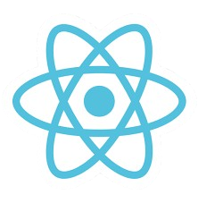
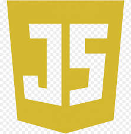
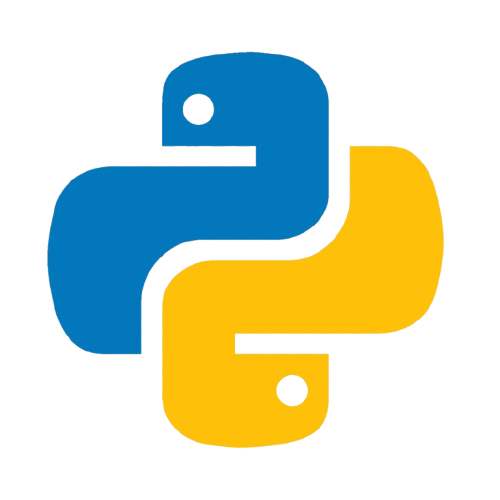
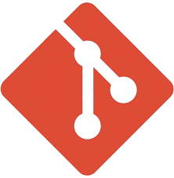
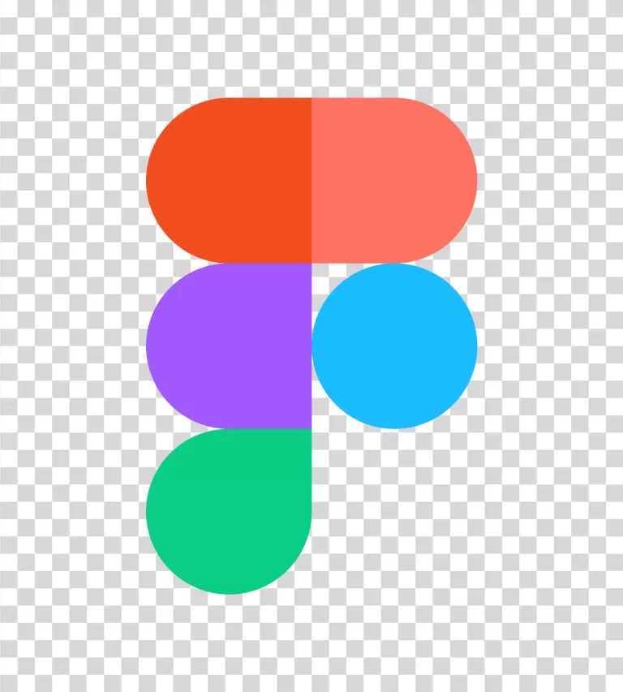

<h1 align="center">
    
</h1>

<h4 align="center">"Good design is invisible, but great design makes people feel something."</h4>

 

💡 **Software Engineer × Program Manager × Product Designer** blending code, creativity, and impact.  
I love turning abstract ideas into real products — from AI-powered Chrome extensions to analytics dashboards that tell stories through data.

🌸 Graduate Student at **University of Washington (MSIM)**, previously led projects across AI, UX, and product analytics — from **Emerald Advisors (AI-curated finance extension)** to **ClaimRunnerAI (legal-tech automation)** and **UW IT dashboards**.

📈 I believe tech should simplify lives — whether that’s reducing research time by 50%, improving retention by 12%, or automating reporting hours out of existence.  

 
  
  
  

🌱 **Tech stack:** React · Node.js · JavaScript · Python · OpenAI API · Tailwind · PostgreSQL · Chrome Extensions · WordPress · Shopify  

🚀 **Focus areas:** AI-driven automation · UX engineering · product strategy · data visualization · LLM integrations  

🧠 **Projects:** Emerald Advisors (LLM Chrome extension) | ClaimRunnerAI (legal AI automation) | Hunch (dating app follow system) | UW IT KPI Dashboard | GitHub Metrics Analyzer  

🎨 Outside of work, you’ll find me sketching UI ideas at coffee shops, exploring Seattle neighborhoods, or reading design philosophy books.

 

  <h2>⚙️ Technologies & Tools ⚙️</h2>
   
  
  
  
  
  
  
  
  
  
  

    <h2>🚀 Featured Projects 🚀</h2>

### 💬 AI & Web Applications
| Project | Description |
| --- | --- |
| <a href="https://github.com/rakkshanda/emerald-advisors" target="_blank">Emerald Advisors Extension</a> |  AI-curated Chrome extension delivering real-time portfolio news with sentiment tagging and ChatGPT integration. Reduced research time by 35%. |
| <a href="https://github.com/rakkshanda/claimrunnerai" target="_blank">ClaimRunnerAI</a> |  Automates legal form generation using LLM pipelines. Built dashboard in React + Tailwind with OpenAI API integration. |
| <a href="https://batch-query-ena2.vercel.app/" target="_blank">BatchQuery Chatbot</a> |  AI chatbot that processes multiple image queries simultaneously with a unified API architecture. |
| <a href="https://github.com/rakkshanda/hunch" target="_blank">Hunch App</a> |  Built “Follow” and feedback systems in React to boost user engagement + 30-day retention by 10%. |

  <h2>📊 GitHub Stats 📊</h2>
   
  
  
   
  

   
  <h4>“Code. Create. Repeat — preferably with coffee in hand ☕”</h4>

