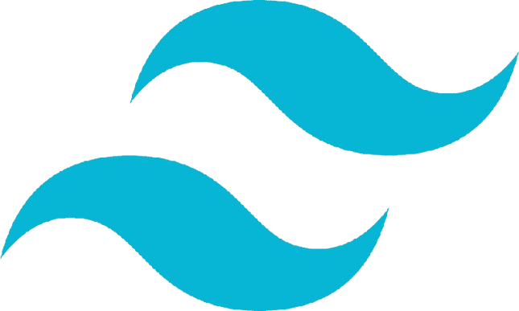
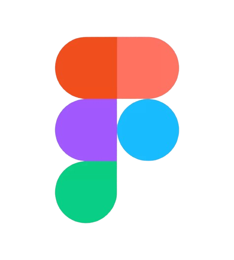

<h1 align="center">
    
</h1>

<h4 align="center">"Good design is invisible, but great design makes people feel something."</h4>

 

💡 <strong>Front-end developer</strong> passionate about accessible, user-centered design.  
I build WordPress themes and React applications that work for real people — from nonprofits supporting young mothers to public universities shaping how prospective students experience campus.

🌸 Recent Graduate at <strong>University of Washington (MSIM)</strong>, previously contributed to UMAC's web ecosystem and built front-end systems at <strong>Hunch, PlotX, and Analytics Quad4</strong> — spanning WordPress plugins, React applications, and content management tools.

📈 I care about the details — semantic HTML, responsive design, performance, and making sure the work serves the people who use it.

 
  
  
 

🌱 <strong>Tech stack:</strong> HTML · CSS · JavaScript · TypeScript · React · WordPress · PHP · MySQL · SASS · jQuery · Bootstrap · Git  
🚀 <strong>Focus areas:</strong> Front-end development · accessibility (WCAG 2.1 AA) · WordPress themes & plugins · responsive design · UX engineering  
🧠 <strong>Projects:</strong> UW Directory Plugin (Folklore) | AIMS UW iSchool Website | South Project TX (nonprofit site) | UMAC KPI Dashboard  
🎨 Outside of work: too much boba, too many tabs, occasional walks.

 

  <h2>⚙️ Technologies & Tools ⚙️</h2>
   
  
  
  
  
  
  
  
  
  
  

    <h2>🚀 Featured Projects 🚀</h2>

### 🌐 Web Applications & WordPress

| Project | Description |
| --- | --- |
| <a href="https://www.washington.edu/docs/plugins/uw-directory-plugin/" target="_blank">UW Directory Plugin (Folklore)</a> | WordPress plugin built for UMAC's Web Strategy team, used by UW departments. Features searchable, filterable people directories with custom post types, ACF Pro, and full keyboard accessibility. |
| <a href="https://aims.ischool.uw.edu" target="_blank">AIMS Website</a> | Full WordPress redesign for the Association of Information Management Students at the UW iSchool. Custom templates, responsive design, and a consistent visual system. |
| <a href="https://github.com/rakkshanda/emerald-advisors" target="_blank">Financial Browser Extension</a> | AI-curated Chrome extension delivering real-time portfolio news with sentiment tagging and ChatGPT integration. Reduced analyst research time by 50%. |

  <h2>✨ GitHub Stats ✨</h2>
   
  
  
   
  

