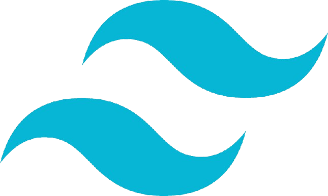
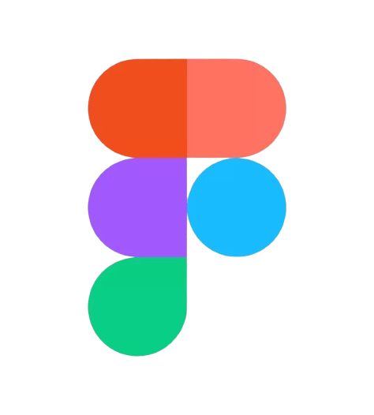

## Hi there 👋

<h1 align="center">
    
</h1>

<h4 align="center">"Good design is invisible, but great design makes people feel something."</h4>
 

 

💡 **Software Engineer × Program Manager × Product Designer** blending code, creativity, and impact.  
I love turning abstract ideas into real products — from AI-powered Chrome extensions to analytics dashboards that tell stories through data.

🌸 Graduate Student at **University of Washington (MSIM)**, previously led projects across AI, UX, and product analytics — from **Emerald Advisors (AI-curated finance extension)** to **ClaimRunnerAI (legal-tech automation)** and **UW IT dashboards**.

📈 I believe tech should simplify lives — whether that’s reducing research time by 50%, improving retention by 12%, or automating reporting hours out of existence.  

 
  
  
  
  

🌱 **Tech stack:** React · Node.js · JavaScript · Python · OpenAI API · Tailwind · PostgreSQL · AWS · Chrome Extensions · WordPress · Shopify  

🚀 **Focus areas:** AI-driven automation · UX engineering · product strategy · data visualization · LLM integrations  

🧠 **Projects:** Emerald Advisors (LLM Chrome extension) | ClaimRunnerAI (legal AI automation) | Hunch (dating app follow system) | UW IT KPI Dashboard | GitHub Metrics Analyzer  

🎨 Outside of work, you’ll find me sketching UI ideas at coffee shops, exploring Seattle neighborhoods, or reading design philosophy books.

⚡ Fun fact: I once built a relationship-planner app and a job-tracker dashboard just to make everyday life more poetic + productive.  

 

  <h2>⚙️ Technologies & Tools ⚙️</h2>
   
  
  
  
  
  
  
  
  
  
  
  
  

    <h2>🚀 Featured Projects 🚀</h2>

### 💬 AI & Web Applications
| Project | Description |
| --- | --- |
| [Emerald Advisors Extension](https://github.com/rakkshanda/emerald-advisors) |  AI-curated Chrome extension delivering real-time portfolio news with sentiment tagging and ChatGPT integration. Reduced research time by 35%. |
| [ClaimRunnerAI](https://github.com/rakkshanda/claimrunnerai) |  Automates legal form generation using LLM pipelines. Built dashboard in React + Tailwind with OpenAI API integration. |
| [UW IT KPI Dashboard](https://github.com/rakkshanda/uwit-dashboard) |  Interactive metrics dashboard tracking PRs, bugs, and delivery KPIs; improved team reporting efficiency by 40%. |
| [BatchQuery Chatbot](https://batch-query-ena2.vercel.app/) |  AI chatbot that processes multiple image queries simultaneously with a unified API architecture. |
| [Hunch App](https://github.com/rakkshanda/hunch) |  Built “Follow†and feedback systems in React to boost user engagement + 30-day retention by 10%. |

  <h2>💻 Social Profiles 💻</h2>

| Platform | Link |
| --- | --- |
| 🧑‍💼 LinkedIn | [linkedin.com/in/rakkshanda](https://www.linkedin.com/in/rakkshanda/) |
| 🌐 Portfolio | [rakkshanda.com](https://rakkshanda.com) |
| 💬 GitHub | [github.com/rakkshanda](https://github.com/rakkshanda) |
| ✨ Dev.to | [dev.to/rakkshanda](https://dev.to/rakkshanda) |
| 🎨 Art & Design | [instagram.com/raksketches](https://instagram.com/raksketches) |

  <h2>📊 GitHub Stats 📊</h2>
   
  
  
   
  

  
   
  <h4>“Code. Create. Repeat — preferably with coffee in hand ☕”</h4>

<!--
**rakkshanda/rakkshanda** is a ✨ _special_ ✨ repository because its `README.md` (this file) appears on your GitHub profile.

Here are some ideas to get you started:

- 🔭 I’m currently working on ...
- 🌱 I’m currently learning ...
- 👯 I’m looking to collaborate on ...
- 🤔 I’m looking for help with ...
- 💬 Ask me about ...
- 📫 How to reach me: ...
- 😄 Pronouns: ...
- ⚡ Fun fact: ...
-->
